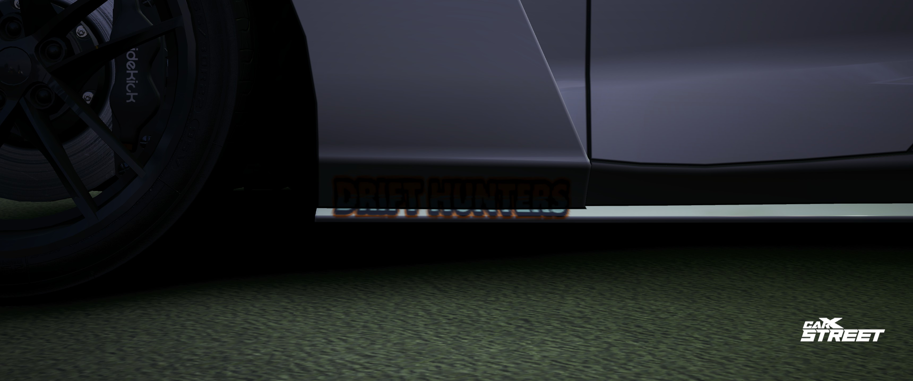
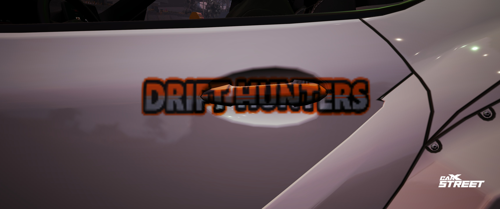
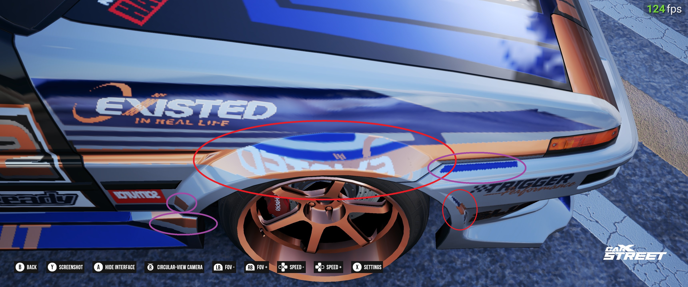
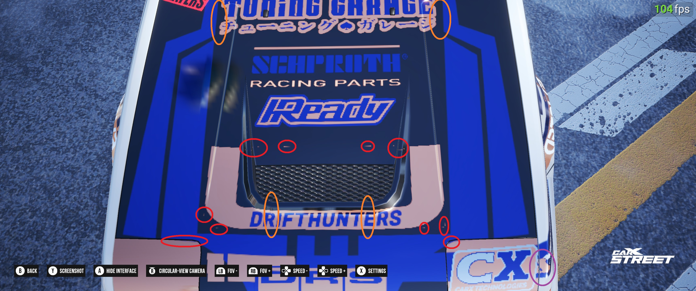
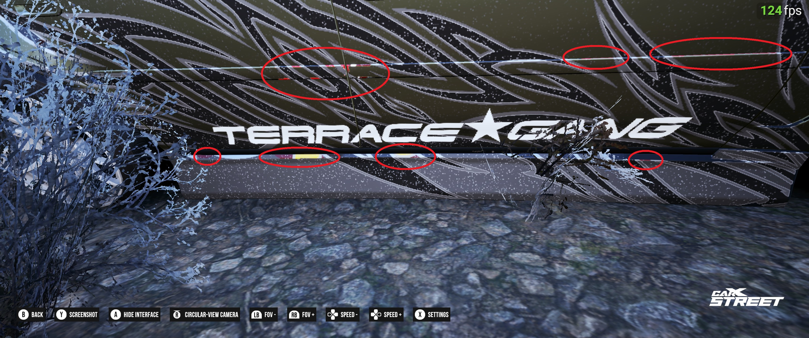

  <b>滑 SURAIDO</b>  
   Livery Contest

---

# 🚗 Rules
1. **Only clean car designs**:
    - No missile-style liveries. (Do you really want us to inspect how good rust or scratches look?)
2. **150+ layers required**:
    - Ensure your design meets this standard.
3. **Streaming required**:
    - Be ready to stream to verify layer details and showcase your work.

---

# 💡 Tips for Success
1. **Use advanced techniques for painting:**
    - Avoid basic methods to paint the whole car. Instead, use layered liveries. This allows for easier corrections and ensures color consistency (especially in "CarX" moments).
2. **Think practically:**
    - Imagine applying the livery in real life. Ask yourself:
      *"Would I actually add this tiny decal that doesn’t make sense if it were missing?"*
3. **Trust your instincts:**
    - If you have doubts about a decal passing inspection, it probably won’t. Fix it until you're confident it meets the standard.
4. **Plan for all views:**
    - Lack of a rooftop design should not ruin the overall livery. For cars with convertible variants (e.g., MX-5), make sure the livery works in all configurations.
    - *(Fail examples in attached pictures [Example 1])*

---

# 🔍 What Inspector Check
Inspectors will evaluate:
1. **Liveries on car part joints.**
2. **Corners and edges.**
3. **Small or unnecessary decals.**
4. **Visible glitches.**
5. **Overstretching of designs.**
6. **Stealth stickers (~hidden decals).**

---

# 📊 Points System

## Deductions
- **Each car part** can only lose **1 point maximum** per section, regardless of the number of mistakes.
- Car parts include:
    - Doors (FL, FR, RL, RR), Bumpers (Front, Rear), Hood, Fenders (FL, FR, RL, RR), Skirts (Left, Right), Windscreen (Front, Rear), Windows (FL, FR, RL, RR, AL, AR), Trunk, Body (Roof, Front, Rear, Other).
- **Minimum possible score**: **-26 points**.

## Bonuses
- **Each car part** can gain **+1 point** if:
    - It passes inspection.
    - It has **40% or more livery coverage** (excluding basic paint methods).
- **Maximum possible score**: **+26 points**.

## Example
If a participant makes 3 mistakes on a bumper, they only lose **1 point** for that section. However, in the event of a tie, this limit is removed.

---

# 🏁 Contest Flow
1. **Event Start:**
    - All participants must stay in one location.
    - **WARNING:** Leaving to visit the styling shop during the contest will result in **-5 points.**
2. **Inspection Process:**
    - When called, participants must turn on their stream in Discord.
    - Participants can choose whether to have the inspector stream and explain mistakes.
        - **WARNING:** If declined, any questionable moments will be decided by the inspector alone.
3. **Patience:**
    - Inspections may take time. Wait calmly while the inspector thoroughly checks your work.
4. **Styling Shop Check:**
    - Once the inspector allows, participants can teleport to the styling shop to show the layer count.
    - Points will be announced after this step.
5. **Tie Breakers:**
    - If scores are tied, the **-1 point per part limit** is lifted, and detailed deductions will be applied.

---

## 🎨 Showcase Your Skills!
Create liveries that stand out and follow the rules to ensure your design gets the recognition it deserves. Good luck, and may the best designer win! 🚗💨

---

## 🖼️ Examples of Livery Check

Mistake classifications are represented by color-coded annotations:
- **Red**: Mistake (-1 point)
- **Green**: Pass
- **Orange**: Dimension/Size Mistake (-1 point)
- **Purple**: May be questionable, asking participant

## Example 1 (removable rooftop):

---

## Example 2 (joint/corner):
### Inspection:

### Explanation:
   - You will never want to put sticker on that part, believe me.

---

## Example 3 (joint/corner):
### Pass:

### Explanation:
- Fits near joint, not full sticker is in the deep part

---

## Example 4 (joint/corner/handle):
### Inspection:

### Explanation:
- Tiny/small parts, rly need them? 

### Pass:

---

## Example 5 (corner/body kit):
### View:

### Inspection:

### Pass:

---

## Example 6 (corner/body kit):
### View:

### Inspection:

### Pass:

---

## Example 7 (joint/corner/positioning):
   ### Inspection:

### Explanation:
- Over the joint, partially in the deep part, poor positioning (right side is lower than left)

### Pass:

---

## Example 8 (skirt):
### View:

### Inspection:

### Pass [dark screenshot]:

---

## Example 9 (handle/body parts):
### View:

### Inspection:

---

## Example 10 (spoiler/etc):
### Inspection:

### Explanation:
- Do you really need that part sticking out??? I bet NO

### Pass

---

## Example 11 (spoiler/etc):
### Inspection:

### Pass:

---

## Example 12 (stealth):
### Inspection:

---

## Random Examples:

---

Copyright 2025 Toomas Park. All rights reserved.
Screenshots in this repository are free to use and are not subject to any specific licensing or restrictions.